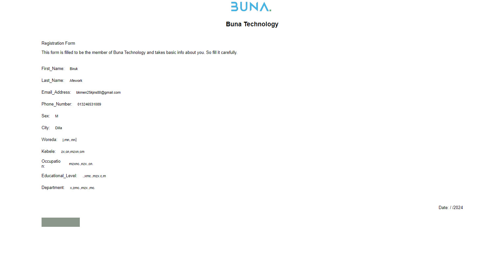
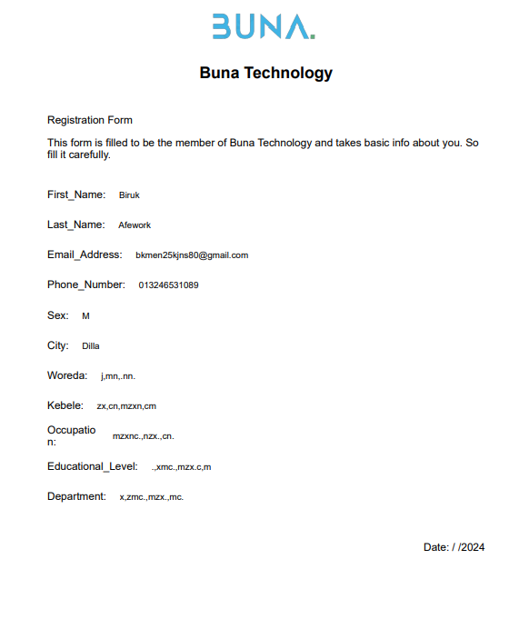

# Simple HTML Form to PDF Converter

This repository contains a basic HTML page that collects user input via a form and Save it in awasome UI without any unwanted content. 

**Here's how it works:**

1. **HTML Form:** The webpage uses an HTML `<form>` element to collect the user input. This includes a text input field for the message and a submit button.
2. **JavaScript:** A simple JavaScript function handles the form submission. It receives the submitted data from the form, converts it into a PDF string format, and then displays the PDF in a new browser window. 

**Installation:**

This code is written for simplicity. No specific libraries or frameworks are used here, so you can easily copy this HTML structure to your own website.

**To Run This Code:**

1. Create an HTML file (e.g., `index.html`).
2. Paste the code below into the HTML file. 
3. Open `index.html` in your browser. You'll see a simple form for entering text.
4. Click on Button Below to print and Done.

# Example How to

## Form to Take User Input

 ## Printed Form to PDf

